# Ashxcribe

Live on: https://scrum-tassk-automation.vercel.app

A multi-tenant SCRUM daily standup platform that records your standups, transcribes them in real-time using Web Speech API and Groq Whisper, generates AI-powered SCRUM documents, and lets you export everything as PDF, DOCX, or audio.

Built with Next.js 16, React 19, Supabase, and Groq AI.

---

## Features

- **Live Transcription** --- Record your standup and see it transcribed in real-time via Web Speech API, with Groq Whisper as a fallback
- **AI SCRUM Generation** --- One-click generation of structured SCRUM documents from your transcript using Llama 3.3 70B
- **Multi-Company Support** --- Manage multiple companies, each with their own templates, sessions, and accent color
- **Custom Templates** --- Create and customize SCRUM document templates with `[placeholder]` fields the AI fills in
- **Session Calendar** --- Monthly calendar view showing all your standup sessions, filterable by company
- **Export** --- Download sessions as PDF, DOCX, or audio (WebM)
- **Audio Playback** --- Built-in audio player with scrubbing for every recorded session
- **6 Themes** --- Obsidian, Midnight, Dusk, Paper, Cream, and Sage

---

## Security

- **Cloudflare Turnstile** --- Bot protection on login and signup. Managed mode silently verifies visitors; the token is validated server-side before any auth call is made
- **Security Headers** --- `X-Frame-Options: DENY`, `X-Content-Type-Options: nosniff`, `Strict-Transport-Security`, `Referrer-Policy`, and `Permissions-Policy` applied to all routes
- **Authentication on all API routes** --- Every API endpoint verifies the Supabase session via `getUser()` and returns 401 for unauthenticated requests
- **Input validation** --- Transcript length capped at 50,000 characters; audio uploads validated for MIME type and capped at 25 MB; export format restricted to an explicit allowlist
- **Row Level Security** --- All Supabase queries are scoped to the authenticated user's ID; no cross-user data access is possible at the application layer
- **Safe filename generation** --- Export filenames strip non-date characters before use in `Content-Disposition` headers

---

## Pages & Functionality

### Login & Signup

Authentication pages powered by Supabase Auth. Email/password login and signup protected by Cloudflare Turnstile bot detection. Automatic redirect to dashboard on success.

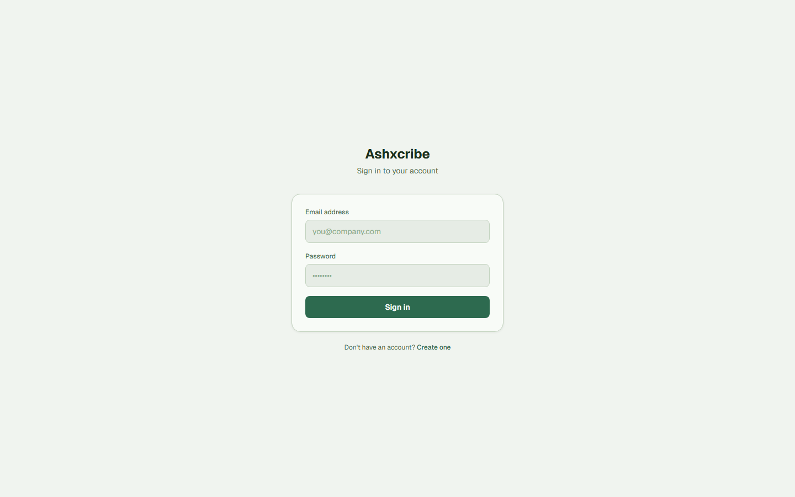

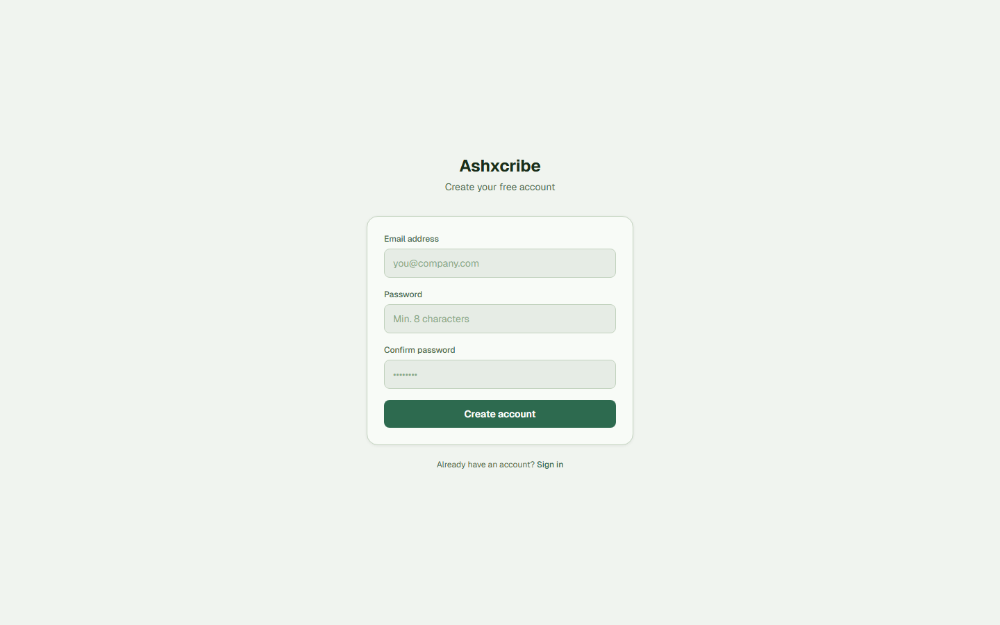

---

### Onboarding

A 3-step setup wizard that guides new users through creating their first company, choosing a SCRUM template, and a quick feature tour.

---

### Dashboard

The main workspace. Two-panel layout: transcript on the left, SCRUM document on the right.

**Recording flow:**
1. Select your company and template from the top bar
2. Tap the mic button to start recording
3. Speak your standup --- transcript appears in real-time
4. Tap stop when done
5. Review the transcript, then click **Save Session** or **Redo** to re-record
6. Click **Generate SCRUM Doc** to produce the AI-filled document
7. Copy the document or navigate to the full session view


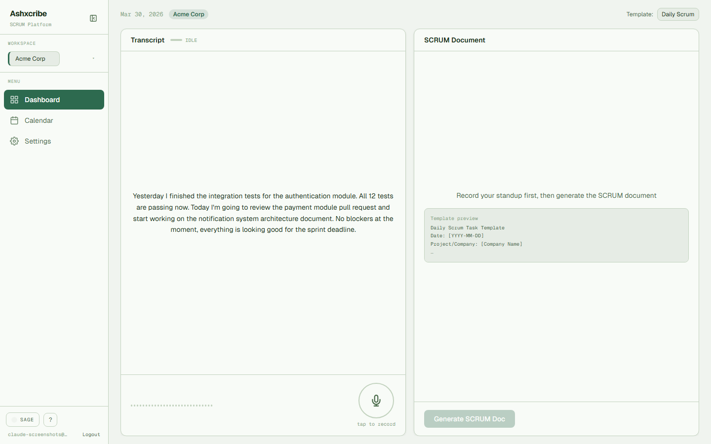

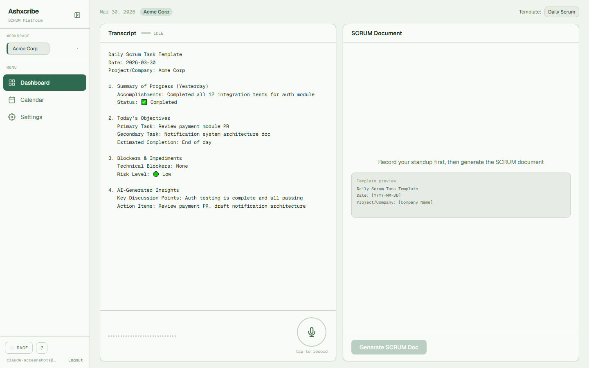

---

### Calendar

Monthly calendar view filtered by the active company. Each day with sessions shows a colored dot and session count.

- **Single session day** --- Click to open the session detail page directly
- **Multiple sessions** --- Click to open a modal with session cards

**Session cards** in the modal show:
- Recording time
- Transcript preview
- Status badges (AUDIO, DOC)
- Actions: Open, Generate Doc, Export (PDF/DOCX/Audio), Delete

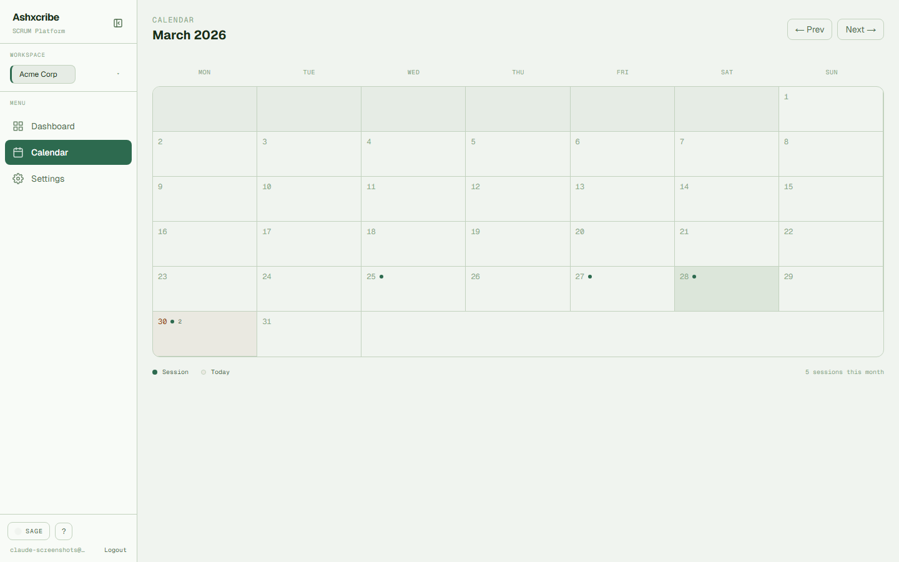

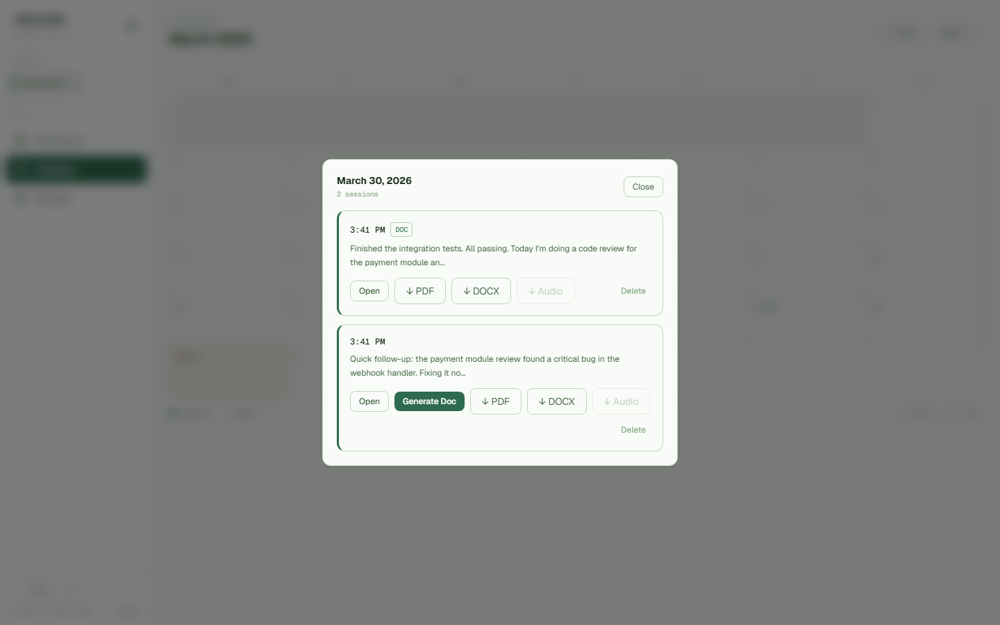

---

### Session Detail

Full view of a recorded session with:

- **Transcript** --- The raw transcription from your standup
- **SCRUM Document** --- The AI-generated document (if generated)
- **Audio Player** --- Play back the recording with scrub/seek support
- **Export** --- Download as PDF, DOCX, or audio file


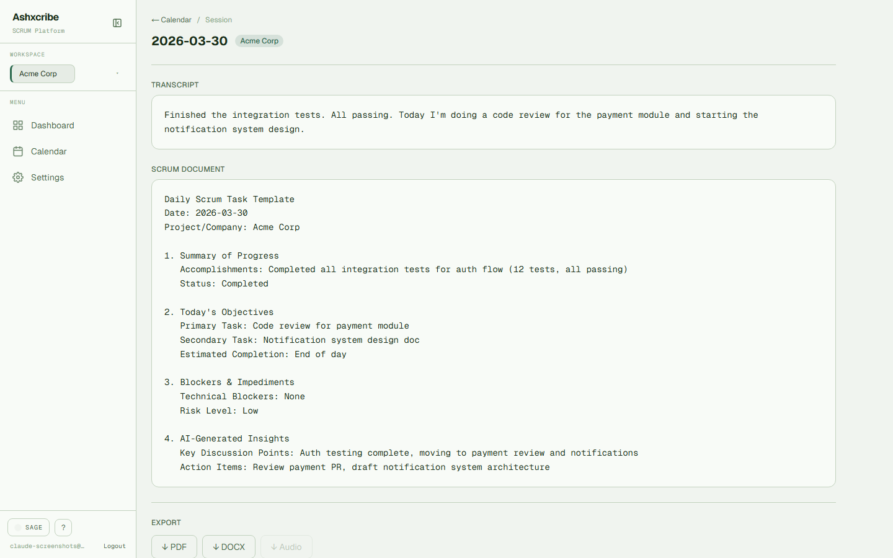

---

### Settings

Manage companies and templates.

**Companies:**
- Create, edit, and delete company profiles
- Assign accent colors to visually distinguish workspaces

**Templates:**
- Create templates from scratch or use the default SCRUM template
- Edit template content with `[placeholder]` fields the AI fills from transcripts
- Set a default template per company


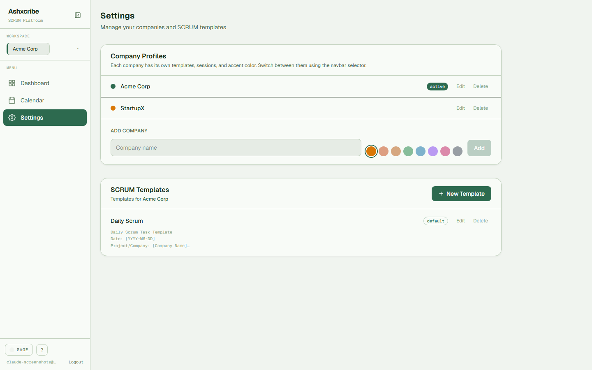

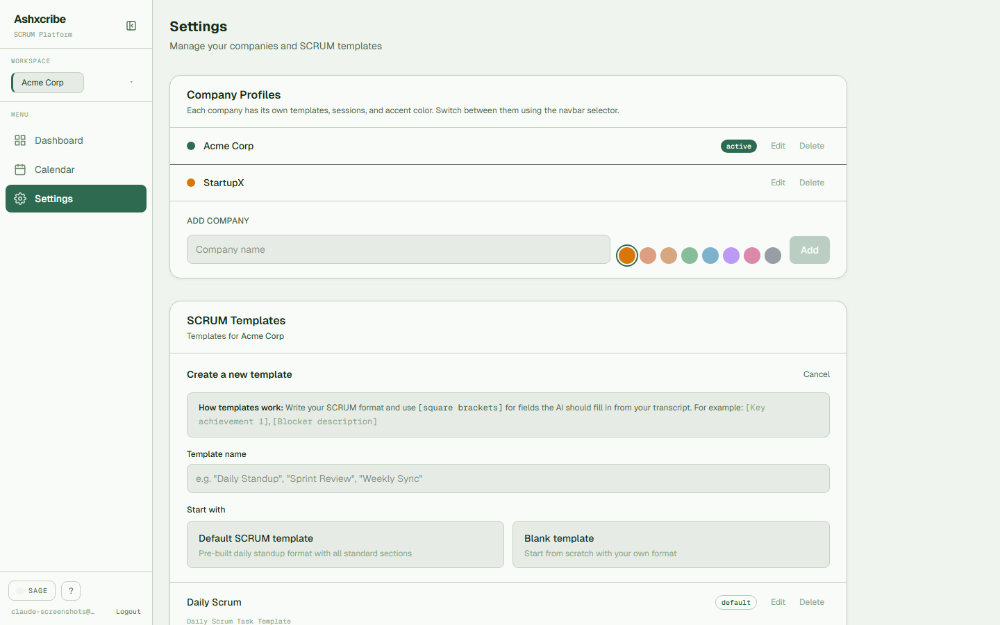

---

### Sidebar & Navigation

Collapsible sidebar with:
- Company selector dropdown
- Navigation links (Dashboard, Calendar, Settings)
- Theme switcher (6 themes)
- Help/guide panel
- User email and logout

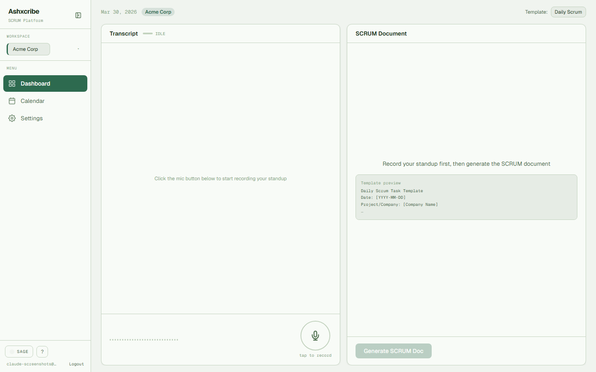

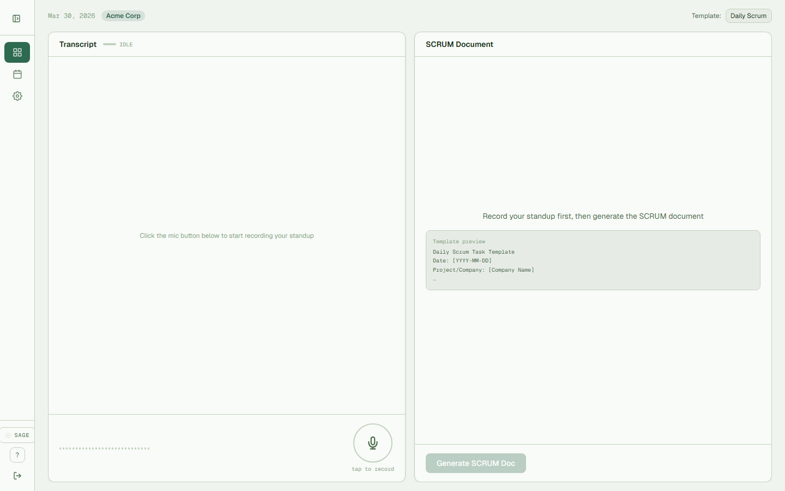

---

### Themes

Six built-in themes. Switch instantly from the sidebar.

| Theme | Style |
|-------|-------|
| **Obsidian** | Dark warm charcoal + amber |
| **Midnight** | Deep navy-black + warm gold |
| **Dusk** | Warm dark maroon + coral |
| **Paper** | Light warm off-white + forest green |
| **Cream** | Warm butter/parchment + terracotta |
| **Sage** | Light muted green + deep forest |

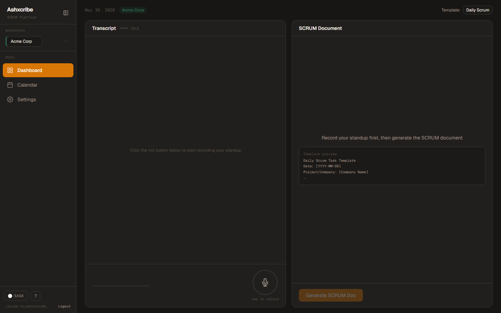


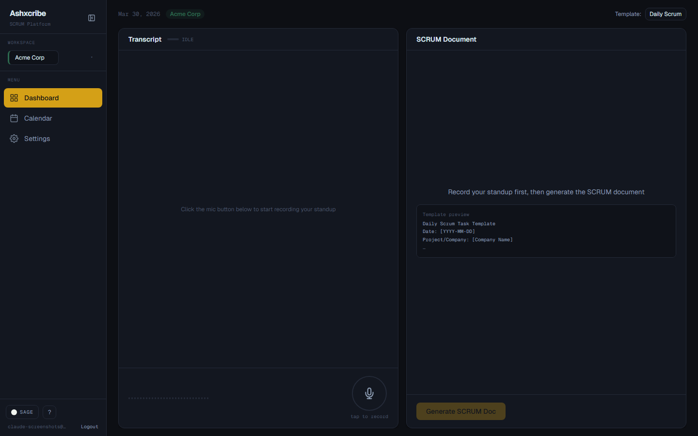

---

## Tech Stack

| Layer | Technology |
|-------|------------|
| **Framework** | Next.js 16 (App Router, Turbopack) |
| **Frontend** | React 19, TypeScript (strict) |
| **Styling** | Tailwind CSS v4 |
| **Auth & DB** | Supabase (PostgreSQL + RLS + Storage) |
| **AI / LLM** | Groq SDK --- Llama 3.3 70B for SCRUM generation |
| **Transcription** | Web Speech API (live) + Groq Whisper (fallback) |
| **Audio** | MediaRecorder API (WebM/Opus) |
| **Bot Protection** | Cloudflare Turnstile |
| **PDF Export** | jsPDF |
| **DOCX Export** | docx |
| **Fonts** | Geist Sans + Geist Mono |

---

## Getting Started

### Prerequisites

- Node.js 18+
- A Supabase project with the required tables (see below)
- A Groq API key ([console.groq.com](https://console.groq.com))
- A Cloudflare Turnstile widget ([dash.cloudflare.com](https://dash.cloudflare.com))

### Environment Variables

Create a `.env.local` file in the root:

```env
NEXT_PUBLIC_SUPABASE_URL=https://your-project.supabase.co
NEXT_PUBLIC_SUPABASE_ANON_KEY=your-anon-key
SUPABASE_SERVICE_ROLE_KEY=your-service-role-key
GROQ_API_KEY=your-groq-key
NEXT_PUBLIC_CF_TURNSTILE_SITE_KEY=your-turnstile-site-key
CF_TURNSTILE_SECRET_KEY=your-turnstile-secret-key
LIVEKIT_API_KEY=your-livekit-key        # optional
LIVEKIT_API_SECRET=your-livekit-secret  # optional
LIVEKIT_URL=wss://your-livekit-url      # optional
```

### Install & Run

```bash
npm install
npm run dev
```

Open [http://localhost:3000](http://localhost:3000).

### Build for Production

```bash
npm run build
npm start
```

---

## Database Schema

### Tables (Supabase PostgreSQL with RLS)

**companies**
| Column | Type | Notes |
|--------|------|-------|
| id | uuid | Primary key |
| user_id | uuid | References auth.users |
| name | text | Company name |
| color | text | Hex accent color |
| created_at | timestamptz | Auto |

**templates**
| Column | Type | Notes |
|--------|------|-------|
| id | uuid | Primary key |
| user_id | uuid | References auth.users |
| company_id | uuid | References companies |
| name | text | Template name |
| content | text | Template body with [placeholders] |
| is_default | boolean | Default template for company |
| created_at | timestamptz | Auto |

**scrum_sessions**
| Column | Type | Notes |
|--------|------|-------|
| id | uuid | Primary key |
| user_id | uuid | References auth.users |
| company_id | uuid | References companies |
| template_id | uuid | References templates (nullable) |
| date | date | Session date |
| transcript | text | Raw transcript |
| generated_document | text | AI-generated SCRUM doc (nullable) |
| audio_url | text | Signed URL (nullable) |
| audio_filename | text | Storage path (nullable) |
| created_at | timestamptz | Auto |

### Storage

- **Bucket:** `audio` (private)
- **Path pattern:** `{user_id}/{company_id}/{timestamp}.webm`
- **RLS policies:** Users can only upload/read their own files

---

## Project Structure

```
app/
  (auth)/          Login, signup pages (Turnstile protected)
  (app)/           Protected app routes
    dashboard/     Main recording + generation UI
    calendar/      Monthly session calendar
    session/[id]/  Session detail page
    settings/      Company & template management
    onboarding/    3-step setup wizard
  api/
    generate-scrum/   Groq LLM SCRUM generation
    transcribe/       Groq Whisper transcription
    export/           PDF/DOCX/audio export
    verify-turnstile/ Cloudflare Turnstile server-side validation
    livekit/token/    LiveKit JWT (optional)
components/        Reusable UI components
context/           React context providers (App, Sidebar, Theme)
lib/
  supabase/        Client & server Supabase helpers
  export.ts        PDF & DOCX generation
  types.ts         Shared TypeScript interfaces
proxy.ts           Auth middleware (Next.js 16 proxy)
next.config.ts     Security headers configuration
```

---

## License

MIT
